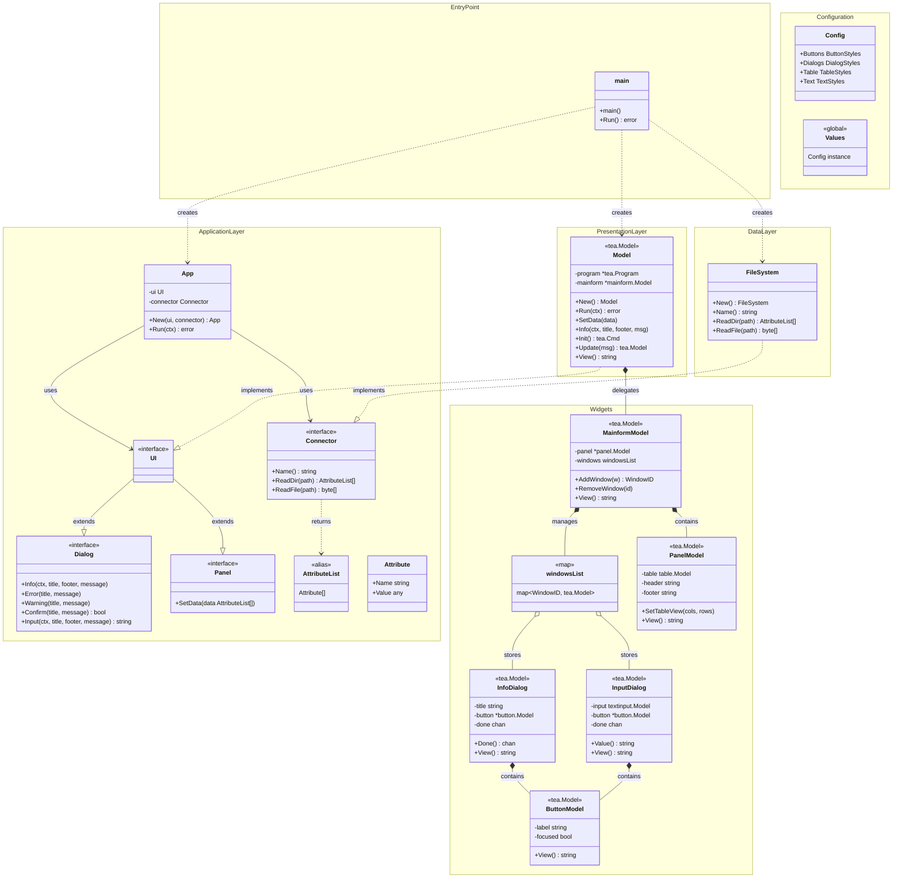
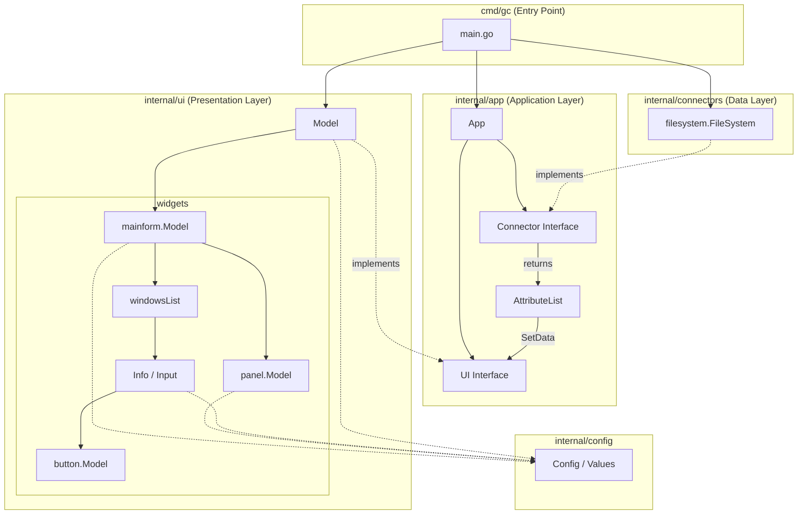
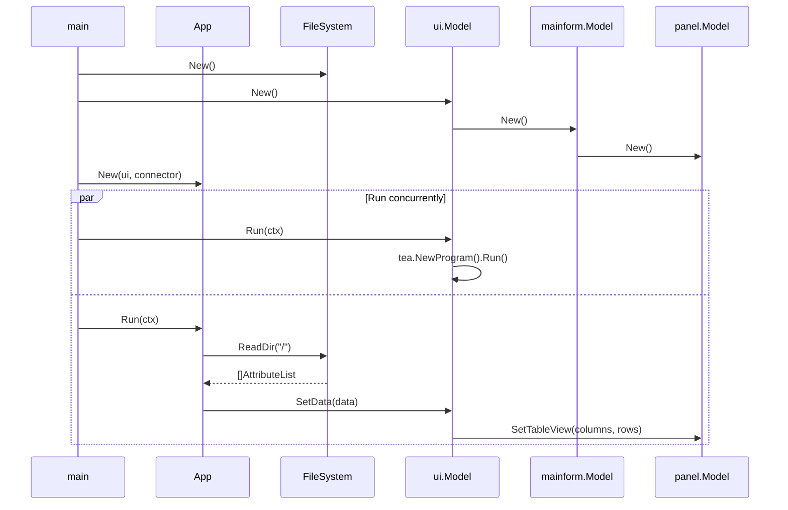
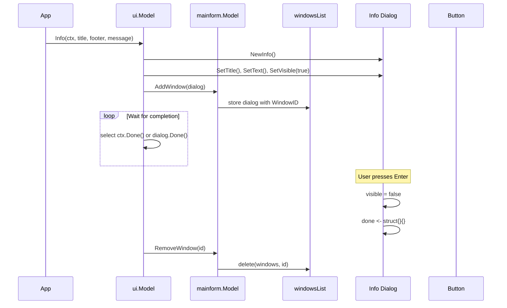

# GC File Manager - Architecture

## Class Diagram



## Component Diagram



## Sequence Diagram - Startup Flow



## Sequence Diagram - Dialog Flow



## Layer Architecture

```
┌─────────────────────────────────────────────────────────────────┐
│                      cmd/gc/main.go                             │
│                      (Entry Point)                              │
│  Creates instances, runs UI and App concurrently via errgroup  │
└───────────────────────────┬─────────────────────────────────────┘
                            │
            ┌───────────────┼───────────────┐
            │               │               │
            ▼               ▼               ▼
┌───────────────────┐ ┌───────────┐ ┌──────────────────┐
│   internal/ui     │ │internal/  │ │ internal/        │
│   (Presentation)  │ │app (App)  │ │ connectors       │
│                   │ │           │ │ (Data Layer)     │
│ Implements:       │ │ Defines:  │ │                  │
│ - UI interface    │ │ - UI      │ │ Implements:      │
│ - Dialog          │ │ - Panel   │ │ - Connector      │
│ - Panel           │ │ - Dialog  │ │                  │
│                   │ │ - Conn.   │ │ filesystem/      │
│ widgets/          │ │           │ │ FileSystem       │
│ - mainform        │ │ App       │ │                  │
│ - panel           │ │ orchestr. │ │                  │
│ - dialogs         │ │ both      │ │                  │
│ - button          │ │           │ │                  │
└───────────────────┘ └───────────┘ └──────────────────┘
            │               │               │
            └───────────────┼───────────────┘
                            │
                            ▼
              ┌─────────────────────────────┐
              │     internal/config         │
              │  (Global Lipgloss Styles)   │
              │                             │
              │  Config.Buttons             │
              │  Config.Dialogs             │
              │  Config.Table               │
              │  Config.Text                │
              └─────────────────────────────┘
```

## Data Flow

```
┌────────────────┐     ReadDir()     ┌─────────────────┐
│   Connector    │ ◄──────────────── │       App       │
│  (FileSystem)  │                   │                 │
└───────┬────────┘                   └────────┬────────┘
        │                                     │
        │ []AttributeList                     │ SetData()
        │                                     │
        ▼                                     ▼
┌────────────────────────────────────────────────────────┐
│                        UI                              │
│  ┌──────────────────────────────────────────────────┐  │
│  │                  mainform.Model                  │  │
│  │  ┌────────────────┐  ┌───────────────────────┐   │  │
│  │  │  panel.Model   │  │     windowsList       │   │  │
│  │  │                │  │  ┌─────┐  ┌─────────┐ │   │  │
│  │  │  ┌──────────┐  │  │  │Info │  │  Input  │ │   │  │
│  │  │  │  table   │  │  │  │     │  │         │ │   │  │
│  │  │  └──────────┘  │  │  └─────┘  └─────────┘ │   │  │
│  │  └────────────────┘  └───────────────────────┘   │  │
│  └──────────────────────────────────────────────────┘  │
└────────────────────────────────────────────────────────┘
```

## Key Design Patterns

| Pattern | Usage |
|---------|-------|
| **Interface Segregation** | UI = Dialog + Panel (separate concerns) |
| **Composition** | Model wraps mainform, mainform contains panel + windows |
| **Strategy** | Connector interface for pluggable data sources |
| **Observer (Channel)** | Dialog.Done() channel signals completion |
| **MVU (Model-View-Update)** | Bubble Tea pattern throughout UI |
| **Singleton** | config.Values global instance |
